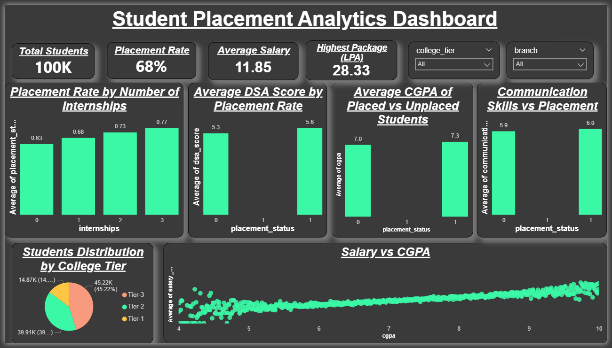

# 🎓 Student Placement Analytics System

## 📌 Project Overview
This project analyzes student data to identify key factors affecting placements and predicts placement outcomes using machine learning.

## 🛠 Tools Used
- Python (Pandas, NumPy, Matplotlib, Scikit-learn)
- Google Colab
- Power BI
- SQL (basic queries)

## 📊 Key Features
- Data cleaning and preprocessing
- Exploratory Data Analysis (EDA)
- Visualization of placement trends
- Machine Learning model for prediction
- Interactive Power BI dashboard

## 📈 Key Insights
- Students with higher DSA scores have better placement chances
- Internships significantly improve placement probability
- Higher CGPA leads to better salary packages

## 🤖 Machine Learning Model
- Model Used: Logistic Regression
- Accuracy: XX% (update your value)

## 📷 Dashboard

## 📁 Files Included
- Dataset
- Jupyter Notebook (analysis)
- Trained model
- Dashboard image

## 🚀 Conclusion
This project helps understand placement trends and can assist students in improving their chances of getting placed.
